

# JavaScript capstone project - VULCANO

This capstone's goal is to create a turn-based RPG game using JavaScript ES6, Webpack and the Phaser 3 game engine.

## Table of Contents

- [Objective](#Objective)
- [Gameplay](#Gameplay)
- [How to Play](#How-to-Play)
- [Live Version](#Live-version)
- [Install and Run](#How-to-Install-and-Run-in-Your-Computer)
- [Acknowledgments](#Acknowledgments)

### Objective

> Main purpose of this project is practicing game development with Javascript. I am using Phaser as the framework. Parcel as the bundler, picked it over webpack as it has fewer configuration (0 in fact), and I will be using JS modern features as modules. API management for scores will also be concerned.

## Built With

- HTML5
- Javascript ES6
- ES6 modules
- Webpack 4
- Phaser 3.54
- Microverse Leaderboard API

### Gameplay

Use the arrow keys to control a knight character on the vulcan terrain. You start on the top left corner and you have to navigate through the map to find the exit on the opposite side. You can hit X key to exit to title screen.

You will run into hidden spots where you will be attacked by two enemies during your journey. These spots are generated randomly at different places at game start. Warning: Sometimes it may appear directly inside a fight area, because the hero happens to fall directly on a hidden spot.

When find a hidden spot, the battle screen starts where you decide which enemy to attack each time. Use arrow keys again to select an enemy and left key / space key to attack. This is a turn-based RPG so each of your team members attacks only once. The enemies will attack you when at their turn. The battle continues until you defeat all monsters or be defeated by them.

After each battle your health will be restored.

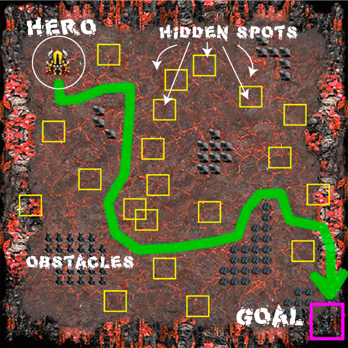

If you reach the exit at the opposite side, your good to go and you won the game.

### How to Play

1. #### Start Screen

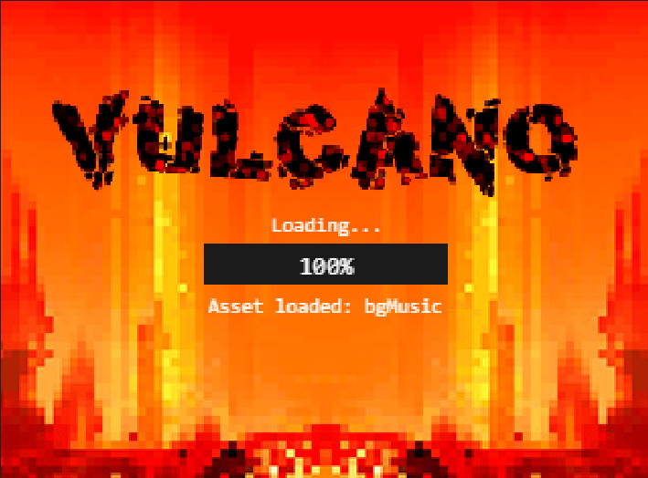

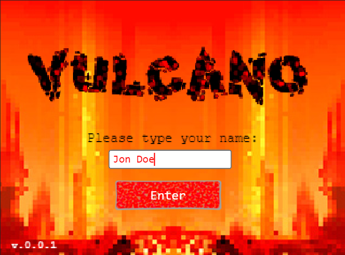

Wait for the game to load and enter your name then hit Enter button.

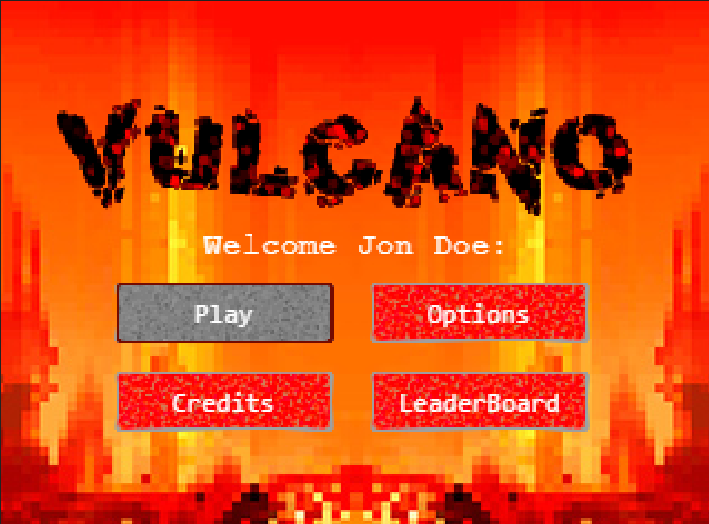

Next screen is the the game menu. You have 4 options:

2. #### Play

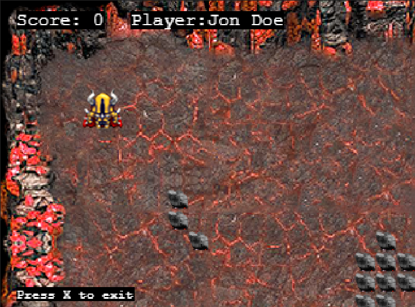

You move your character on the screen by using the four arrow keys. You can move up, down, left, right, and even diagonally if you keep to arrows pressed simultaneously.

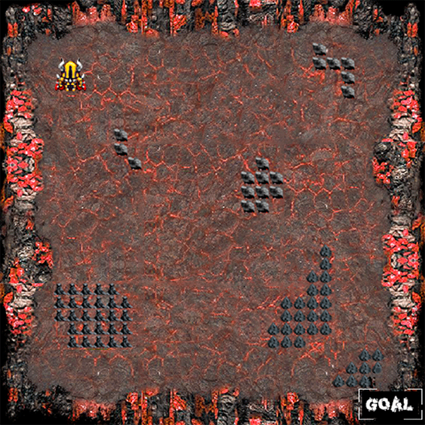

Here you can see the whole map of Vulcano. THe game only shows a portion of the map.
- #### Battlefield

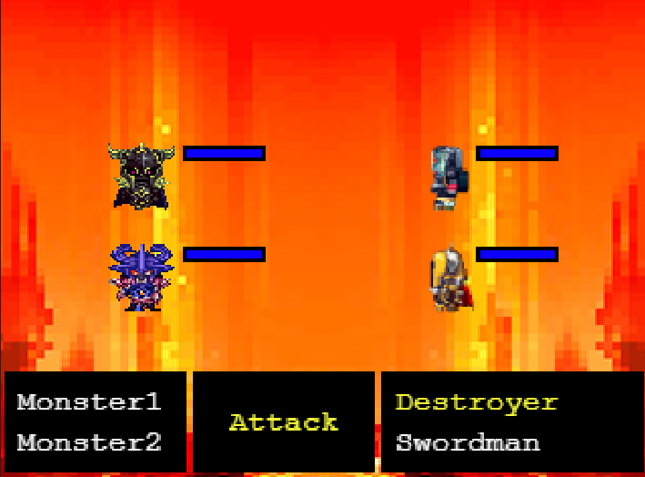

When a hidden spot is found (there are 30 of them) you appear on the vulcan fight area. On the left side of the screen are the attacking enemies. On the right side is your team. You, the Swordman,  and the Destroyer. Below them are three dark areas. The left one lists the names of the monster enemies, the right one your team, and in the middle are the available commands. Currently, the only available command is 'Attack'.

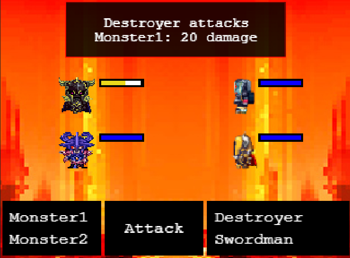

Your team starts attacking first, one at a time. The attacker's name is in yellow letters. By pressing the up and down arrow you can select which monster to attack. After selecting press left key or space key to attack.

If you kill all the enemies you return to the forest and you can proceed with your quest. If you lose all your team it is 'Game Over' and you are taken to the 'Game Over' scene. If you are victorious at every fight, and get the other corner of the map, you are taken to the 'victory' screen.

3. #### Options

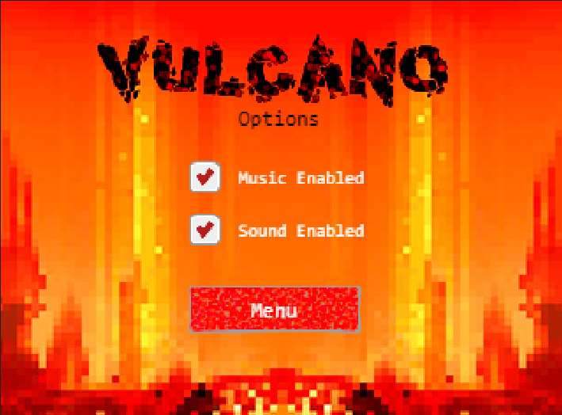

'Music Enabled' checkbox toggles music on/off.

'Sound Enabled' checkbox toggles sound on/off.

4. #### Credits

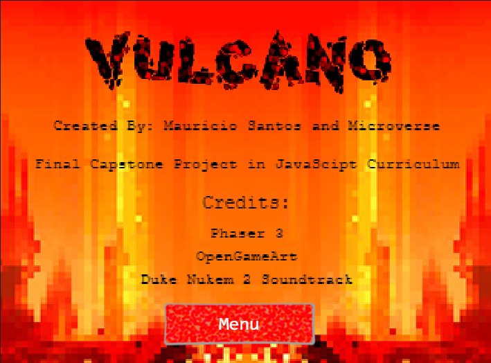

Credits for this game.

5. #### LeaderBoard

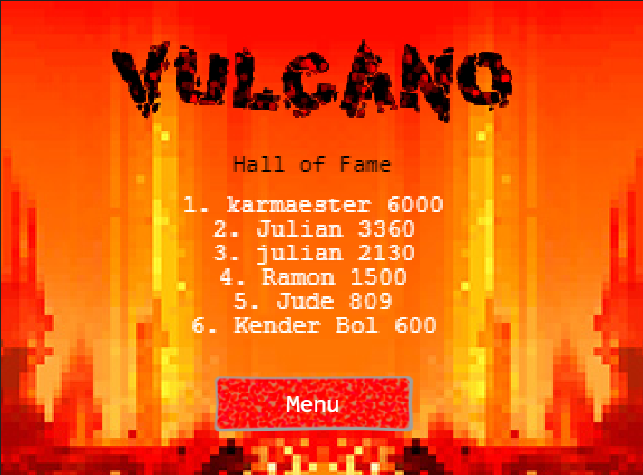

Hall of fame players are listed on the LeaderBoard.

### Live version

- [**Vulcano**](http://mauriciosantos.paternit.com/io/vulcano/)

### How to Install and Run in Your Computer

To run the scripts **npm** is required. To get npm you have to install [Node.js](https://nodejs.org). Follow the installation instructions for your system Mac, Linux or Windows.

Use your terminal and run the commands after each instruction.

| Command                                               | Description                                           |
| ---------------------------------------------------   | ----------------------------------------------------- |
| `git clone https://github.com/maosan132/rpg-game.git` | Clone the repository to you computer                  |
| `cd rpg-game`                                         | Navigate to the newly created folder                  |
| `npm install`                                         | Install dependencies and launch browser with examples |
| `npm run start`                                       | Makes the build and starts the development server     |
|                                                       | Press `Ctrl + c` to kill **http-server** process      |
| `http://localhost:9000`                               | Visit this link to play the game                      |

## Acknowledgements

- Dark Forest Background image By Google Images
- Background music from Duke Nukem 2 Game
- Player images by [OpenGameArt](https://opengameart.com)
- Hat tip to anyone whose code was used

## Upcoming features

- Enhance the attacks with sound
- Give instructions on-the-game as to how to apply attacks"
- Add other type of attacks
- Add power-ups inside the forest to restore user power.
- Enhance resolution

## 👤 Author

👤 **Mauricio Santos**

- Github: [@maosan132](https://github.com/maosan132)
- Twitter: [@maosan132](https://twitter.com/maosan132)
- Linkedin: [maurisantos](https://www.linkedin.com/in/mauricsantos)

## 🤝 Contributing

Contributions, issues and feature requests are welcome!

Feel free to check the [issues page](https://github.com/maosan132/rpg-game/issues).

1. Fork it (https://github.com/maosan132/rpg-game/fork)
2. Create your feature branch (git checkout -b my-new-feature)
3. Commit your changes (git commit -am 'Add some feature')
4. Push to the branch (git push origin my-new-feature)
5. Create a new Pull Request

## Show your support

Give a ⭐️ if you like this project!

## 📝 License

This project is [MIT](lic.url) licensed.

[Go up](#Table-of-Contents)
